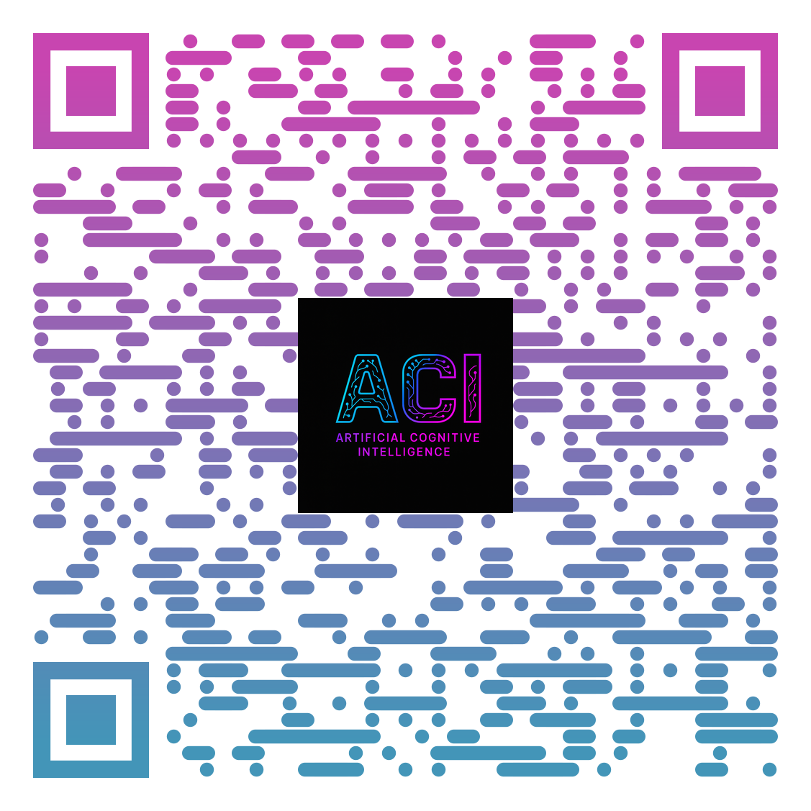

# AI-System
#  Cognitive AI System for Decision Support in Complex Environments

### Developed by: Ghayda M alharbi | 2025 | KSA  
**Registered Intellectual Property – Saudi Authority for Intellectual Property**

##  Overview

This project presents a novel cognitive AI model designed to support human decision-making in complex and high-pressure environments such as healthcare, cybersecurity, and environmental energy sectors.  

The system functions without physiological sensors. Instead, it analyzes user input (text or speech), detects emotional and contextual cues, and generates dialogue-based responses that are psychologically supportive and context-aware.

The goal is to minimize user confusion, reduce decision fatigue, and enhance clarity in moments of uncertainty and risk.

## Why This Project?

- Most current AI systems are logic-driven, not human-driven.
- There's a missing layer of **cognitive empathy** in decision-making systems.
- This project bridges symbolic AI with neural processing and emotional modeling to simulate **intelligent, emotionally-aware dialogue**.

##  Key Features

-  Text and speech-based input (no sensors)
-  Context and emotion detection
-  Step-by-step response flow
-  Hybrid symbolic-neural cognitive design
-  Human-centric & ethical design principles

##  What’s Inside

| File | Description |
|------|-------------|
| `Cognitive AI systems thesis .pdf` — Full documented research (Arabic)
|`IMG_0923.jpeg` — Use Case Diagram (system flow)
| `ACI_Logo.png` | Visual project identity |
| `QR_Code.png` | Shareable access QR |

##  Real-Life Use Cases

- **Medical Operations**: A doctor facing uncertainty before surgery can consult the system to simulate the safest decision flow based on incomplete or conflicting patient data.
- **Cybersecurity Threats**: In the case of a silent, sophisticated attack, the system guides security officers through priority-based responses.
- **Environmental Energy Management**: In business crises, the system helps executives assess risks and adjust strategies with clarity and emotional balance.

##  Intellectual Property

This work is officially registered with the **Saudi Authority for Intellectual Property**  
 Registration Number: `25-12-32961135`  
 Author: Ghayda bint Mohammed Alharbi

##  Future Enhancements & Meta-Intelligence Integration

This cognitive AI system is designed with a scalable architecture that opens the door for future integration with **Meta-Intelligence** technologies.

Planned future developments include:

-   Self-reflective feedback loops to evaluate the quality of decisions made
-   Adaptive learning from past user interactions and errors
-   Meta-cognition modules that monitor the system’s own reasoning process
-   Confidence-based reasoning layers to rank or challenge its own outputs
-   Integration with external ethical frameworks and real-time scenario modeling

By evolving into a **Meta-Intelligent System**, this project aims to not only support decision-making but also reflect on, evaluate, and **optimize the way decisions are made** — creating a more autonomous, ethical, and human-aligned AI framework.

This aligns with long-term ambitions in Artificial General Intelligence (AGI), responsible AI design, and human-AI cognitive synergy.

##  Let’s Connect

Feel free to fork this repo, suggest improvements, or collaborate.  
You can reach me via email or LinkedIn https://www.linkedin.com/in/ghayda-alharbi-50998812a?utm_source=share&utm_campaign=share_via&utm_content=profile&utm_medium=ios_app

## 🔗 Project Repository

📎 Scan the QR code to open the GitHub repository:

Explore the full project here:  
[🔗 https://github.com/Ghaydamalharbi/AI-System](https://github.com/Ghaydamalharbi/AI-System)
